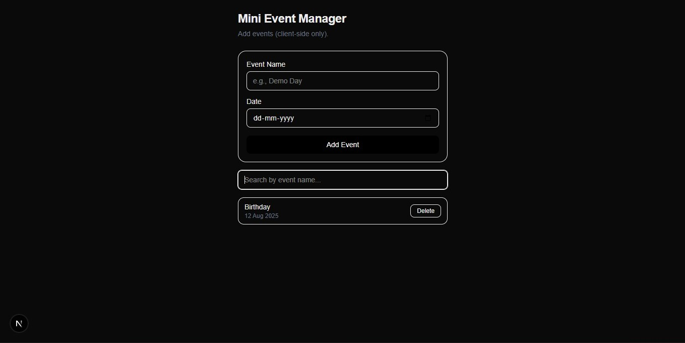

# Mini Event Manager — PyCray Assignment (Next.js App Router)

A tiny events page built **inside the Next-Forge Turborepo** (pnpm + Turborepo).  
This implementation follows the assignment constraints: **client-side only**, **/events** route, **Add/List/Delete**, and basic Tailwind styling.

---

## How to run
```bash
pnpm install
pnpm dev
```

## Screenshot
Open http://localhost:3002/events

